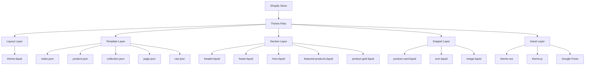
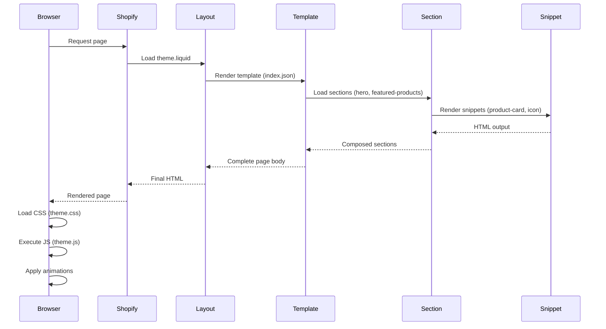

# Design Document: VELLA Shopify Theme

## Overview

VELLA is a custom Shopify theme designed for clean girl/soft luxury dropshipping stores targeting women aged 18-35 in the United States. The theme embodies quiet luxury and warm minimalism with an editorial fashion aesthetic, built using Shopify Liquid templating, vanilla CSS with custom properties, and vanilla JavaScript. The design prioritizes performance (Lighthouse 90+ mobile), accessibility (WCAG compliance), and a cohesive brand experience across all touchpoints.

The theme follows Shopify Online Store 2.0 architecture with JSON section schemas, enabling merchants to customize layouts through the theme editor without code modifications. The implementation uses a mobile-first responsive approach with no external CSS frameworks or jQuery dependencies, ensuring fast load times and optimal performance.

## Architecture



## Main Workflow: Page Rendering



## Design System

### Color Palette

```css
:root {
  /* Primary Colors */
  --color-cream: #FAF7F2;
  --color-warm-white: #FFFCF7;
  --color-sand: #E8DFD0;
  --color-taupe: #C9B8A8;
  --color-espresso: #3D3028;
  
  /* Accent Colors */
  --color-gold: #D4AF37;
  --color-blush: #F5E6E8;
  --color-sage: #B8C5B0;
  
  /* Semantic Colors */
  --color-text-primary: var(--color-espresso);
  --color-text-secondary: #6B5D52;
  --color-background: var(--color-warm-white);
  --color-surface: var(--color-cream);
  --color-border: var(--color-sand);
  --color-error: #C84B31;
  --color-success: var(--color-sage);
}
```

### Typography System

```css
:root {
  /* Font Families */
  --font-heading: 'Cormorant Garamond', serif;
  --font-body: 'DM Sans', sans-serif;
  
  /* Font Sizes */
  --font-size-xs: 0.75rem;    /* 12px */
  --font-size-sm: 0.875rem;   /* 14px */
  --font-size-base: 1rem;     /* 16px */
  --font-size-lg: 1.125rem;   /* 18px */
  --font-size-xl: 1.5rem;     /* 24px */
  --font-size-2xl: 2rem;      /* 32px */
  --font-size-3xl: 2.5rem;    /* 40px */
  --font-size-4xl: 3rem;      /* 48px */
  
  /* Font Weights */
  --font-weight-light: 300;
  --font-weight-normal: 400;
  --font-weight-medium: 500;
  --font-weight-semibold: 600;
  --font-weight-bold: 700;
  
  /* Line Heights */
  --line-height-tight: 1.2;
  --line-height-normal: 1.5;
  --line-height-relaxed: 1.75;
  
  /* Letter Spacing */
  --letter-spacing-tight: -0.02em;
  --letter-spacing-normal: 0;
  --letter-spacing-wide: 0.05em;
  --letter-spacing-wider: 0.1em;
}
```

### Spacing System

```css
:root {
  --spacing-xs: 0.25rem;   /* 4px */
  --spacing-sm: 0.5rem;    /* 8px */
  --spacing-md: 1rem;      /* 16px */
  --spacing-lg: 1.5rem;    /* 24px */
  --spacing-xl: 2rem;      /* 32px */
  --spacing-2xl: 3rem;     /* 48px */
  --spacing-3xl: 4rem;     /* 64px */
  --spacing-4xl: 6rem;     /* 96px */
  --spacing-5xl: 8rem;     /* 128px */
}
```

### Shadow System

```css
:root {
  --shadow-sm: 0 1px 2px rgba(61, 48, 40, 0.05);
  --shadow-md: 0 4px 6px rgba(61, 48, 40, 0.07);
  --shadow-lg: 0 10px 15px rgba(61, 48, 40, 0.1);
  --shadow-xl: 0 20px 25px rgba(61, 48, 40, 0.15);
}
```

### Transition System

```css
:root {
  --transition-fast: 150ms ease-in-out;
  --transition-base: 250ms ease-in-out;
  --transition-slow: 350ms ease-in-out;
  --transition-drawer: 400ms cubic-bezier(0.4, 0, 0.2, 1);
}
```

### Responsive Breakpoints

```css
:root {
  --breakpoint-sm: 640px;   /* Mobile landscape */
  --breakpoint-md: 768px;   /* Tablet portrait */
  --breakpoint-lg: 1024px;  /* Tablet landscape */
  --breakpoint-xl: 1280px;  /* Desktop */
  --breakpoint-2xl: 1536px; /* Large desktop */
}
```

### Animation Keyframes

```css
@keyframes fadeIn {
  from { opacity: 0; }
  to { opacity: 1; }
}

@keyframes fadeInUp {
  from {
    opacity: 0;
    transform: translateY(20px);
  }
  to {
    opacity: 1;
    transform: translateY(0);
  }
}

@keyframes zoomIn {
  from {
    opacity: 0;
    transform: scale(0.95);
  }
  to {
    opacity: 1;
    transform: scale(1);
  }
}

@keyframes slideInRight {
  from { transform: translateX(100%); }
  to { transform: translateX(0); }
}

@keyframes slideInLeft {
  from { transform: translateX(-100%); }
  to { transform: translateX(0); }
}
```

## Components and Interfaces

### Component 1: Header Section

**Purpose**: Primary navigation and branding, includes announcement bar, logo, main navigation, cart icon, and mobile menu drawer.

**Interface**:
```liquid

{
  "name": "Header",
  "settings": [
    {
      "type": "text",
      "id": "announcement_text",
      "label": "Announcement Text"
    },
    {
      "type": "url",
      "id": "announcement_link",
      "label": "Announcement Link"
    },
    {
      "type": "link_list",
      "id": "main_menu",
      "label": "Main Menu"
    }
  ]
}

```

**Responsibilities**:
- Display announcement bar with promotional message
- Render logo and brand identity
- Provide main navigation menu (desktop)
- Show cart icon with item count
- Toggle mobile menu drawer
- Maintain sticky positioning on scroll
- Handle keyboard navigation for accessibility

**Structure**:
```
┌─────────────────────────────────────────────┐
│  Free Shipping on Orders Over $75 ✕         │ ← Announcement Bar
├─────────────────────────────────────────────┤
│  ☰  VELLA        Shop  About  Contact  🛒   │ ← Main Header
└─────────────────────────────────────────────┘
```

### Component 2: Hero Section

**Purpose**: Homepage hero banner with full-width image, headline, subheadline, and call-to-action button.

**Interface**:
```liquid

{
  "name": "Hero",
  "settings": [
    {
      "type": "image_picker",
      "id": "hero_image",
      "label": "Hero Image"
    },
    {
      "type": "text",
      "id": "hero_heading",
      "label": "Heading",
      "default": "Quiet Luxury, Elevated Everyday"
    },
    {
      "type": "textarea",
      "id": "hero_subheading",
      "label": "Subheading"
    },
    {
      "type": "text",
      "id": "button_text",
      "label": "Button Text",
      "default": "Shop Now"
    },
    {
      "type": "url",
      "id": "button_link",
      "label": "Button Link"
    },
    {
      "type": "select",
      "id": "text_alignment",
      "label": "Text Alignment",
      "options": [
        { "value": "left", "label": "Left" },
        { "value": "center", "label": "Center" },
        { "value": "right", "label": "Right" }
      ],
      "default": "center"
    }
  ]
}

```

**Responsibilities**:
- Display full-width hero image with WebP format support
- Render headline with Cormorant Garamond font
- Show subheadline and CTA button
- Apply fade-in animation on page load
- Ensure responsive image sizing
- Maintain aspect ratio across devices

### Component 3: Product Card Snippet

**Purpose**: Reusable product card component displaying product image, title, price, and quick view functionality.

**Interface**:
```liquid

  Renders a product card

  Accepts:
  - product: {Object} Product object
  - show_vendor: {Boolean} Show vendor name (optional)
  - show_quick_view: {Boolean} Show quick view button (optional)
  - image_ratio: {String} Image aspect ratio (optional)

  Usage:
  

```

**Responsibilities**:
- Display product featured image with lazy loading
- Show product title, vendor (optional), and price
- Handle sale price display with compare-at price
- Provide hover effects (image zoom, button reveal)
- Support quick view modal trigger
- Ensure accessibility with proper ARIA labels

### Component 4: Cart Drawer

**Purpose**: Slide-out cart panel from right side showing cart items, subtotal, and checkout button.

**Interface**:
```javascript
class CartDrawer {
  constructor() {
    this.drawer = document.querySelector('[data-cart-drawer]');
    this.overlay = document.querySelector('[data-cart-overlay]');
    this.closeButton = document.querySelector('[data-cart-close]');
    this.init();
  }

  init() {
    // Initialize event listeners
  }

  open() {
    // Open drawer with slide-in animation
  }

  close() {
    // Close drawer with slide-out animation
  }

  updateCart(items) {
    // Update cart contents via AJAX
  }

  addItem(variantId, quantity) {
    // Add item to cart via Shopify Cart API
  }

  removeItem(lineItemKey) {
    // Remove item from cart
  }

  updateQuantity(lineItemKey, quantity) {
    // Update item quantity
  }
}
```

**Responsibilities**:
- Slide in from right with overlay
- Display cart line items with thumbnails
- Show quantity controls (+/- buttons)
- Calculate and display subtotal
- Provide remove item functionality
- Handle AJAX cart updates without page reload
- Close on overlay click or ESC key
- Trap focus within drawer for accessibility

### Component 5: Product Gallery

**Purpose**: Product page image gallery with thumbnail navigation and zoom functionality.

**Interface**:
```javascript
class ProductGallery {
  constructor(element) {
    this.container = element;
    this.mainImage = element.querySelector('[data-main-image]');
    this.thumbnails = element.querySelectorAll('[data-thumbnail]');
    this.currentIndex = 0;
    this.init();
  }

  init() {
    // Initialize thumbnail click handlers
    // Set up keyboard navigation
  }

  selectImage(index) {
    // Update main image
    // Update active thumbnail
  }

  nextImage() {
    // Navigate to next image
  }

  previousImage() {
    // Navigate to previous image
  }

  enableZoom() {
    // Enable image zoom on hover/click
  }
}
```

**Responsibilities**:
- Display main product image
- Show thumbnail navigation below main image
- Handle thumbnail click to change main image
- Support keyboard navigation (arrow keys)
- Enable zoom functionality on desktop
- Ensure responsive layout (stack on mobile)
- Lazy load images for performance

### Component 6: Mobile Menu Drawer

**Purpose**: Slide-out navigation menu for mobile devices.

**Interface**:
```javascript
class MobileMenu {
  constructor() {
    this.drawer = document.querySelector('[data-mobile-menu]');
    this.overlay = document.querySelector('[data-menu-overlay]');
    this.toggleButton = document.querySelector('[data-menu-toggle]');
    this.closeButton = document.querySelector('[data-menu-close]');
    this.init();
  }

  init() {
    // Initialize event listeners
  }

  open() {
    // Slide in from left
    // Lock body scroll
    // Trap focus
  }

  close() {
    // Slide out to left
    // Unlock body scroll
    // Return focus to toggle button
  }

  handleSubmenu(item) {
    // Expand/collapse submenu items
  }
}
```

**Responsibilities**:
- Slide in from left side
- Display navigation links vertically
- Handle submenu expansion/collapse
- Close on overlay click or close button
- Lock body scroll when open
- Trap focus for accessibility
- Support keyboard navigation

### Component 7: Collection Filters

**Purpose**: Product filtering and sorting interface for collection pages.

**Interface**:
```javascript
class CollectionFilters {
  constructor(element) {
    this.container = element;
    this.filterForm = element.querySelector('[data-filter-form]');
    this.sortSelect = element.querySelector('[data-sort-select]');
    this.filterToggles = element.querySelectorAll('[data-filter-toggle]');
    this.init();
  }

  init() {
    // Initialize filter event listeners
  }

  applyFilters() {
    // Update URL with filter parameters
    // Fetch filtered products via AJAX
    // Update product grid
  }

  updateSort(sortValue) {
    // Update sort parameter
    // Reload products with new sort
  }

  toggleFilterGroup(group) {
    // Expand/collapse filter group
  }

  clearFilters() {
    // Reset all filters
    // Reload default products
  }
}
```

**Responsibilities**:
- Display filter options (price, size, color, etc.)
- Handle filter selection/deselection
- Update URL with filter parameters
- Fetch filtered products without page reload
- Show active filter count
- Provide clear filters button
- Handle sort dropdown (price, newest, etc.)
- Maintain filter state in URL

## Data Models

### Model 1: Product

```liquid
{
  "id": Number,
  "title": String,
  "handle": String,
  "vendor": String,
  "type": String,
  "price": Number,
  "compare_at_price": Number,
  "available": Boolean,
  "featured_image": {
    "src": String,
    "alt": String,
    "width": Number,
    "height": Number
  },
  "images": Array<Image>,
  "variants": Array<Variant>,
  "options": Array<Option>,
  "tags": Array<String>,
  "description": String
}
```

**Validation Rules**:
- `title` must not be empty
- `price` must be non-negative
- `featured_image.src` must be valid URL
- At least one variant must exist
- `handle` must be unique and URL-safe

### Model 2: Cart

```liquid
{
  "item_count": Number,
  "total_price": Number,
  "items": Array<LineItem>,
  "currency": String,
  "requires_shipping": Boolean
}
```

**LineItem Structure**:
```liquid
{
  "id": Number,
  "key": String,
  "product_id": Number,
  "variant_id": Number,
  "title": String,
  "price": Number,
  "quantity": Number,
  "line_price": Number,
  "image": String,
  "url": String,
  "vendor": String,
  "properties": Object
}
```

**Validation Rules**:
- `quantity` must be positive integer
- `quantity` must not exceed variant inventory
- `price` must be non-negative
- `key` must be unique per line item

### Model 3: Section Schema

```json
{
  "name": "Section Name",
  "tag": "section",
  "class": "section-class",
  "settings": [
    {
      "type": "text|textarea|image_picker|url|select|checkbox|range",
      "id": "setting_id",
      "label": "Setting Label",
      "default": "Default Value",
      "info": "Helper text"
    }
  ],
  "blocks": [
    {
      "type": "block_type",
      "name": "Block Name",
      "settings": []
    }
  ],
  "presets": [
    {
      "name": "Preset Name",
      "settings": {}
    }
  ]
}
```

**Validation Rules**:
- `name` is required and must be unique
- `settings[].id` must be unique within section
- `settings[].type` must be valid Shopify setting type
- `blocks[].type` must be unique within section

## Algorithmic Pseudocode

### Main Processing Algorithm: Cart Update

```pascal
ALGORITHM updateCart(variantId, quantity, action)
INPUT: variantId (Number), quantity (Number), action (String: "add"|"update"|"remove")
OUTPUT: updatedCart (Cart object)

BEGIN
  ASSERT variantId > 0
  ASSERT quantity >= 0
  ASSERT action IN ["add", "update", "remove"]
  
  // Step 1: Prepare request data
  requestData ← {
    id: variantId,
    quantity: quantity
  }
  
  // Step 2: Determine API endpoint
  IF action = "add" THEN
    endpoint ← "/cart/add.js"
  ELSE IF action = "update" THEN
    endpoint ← "/cart/change.js"
  ELSE IF action = "remove" THEN
    requestData.quantity ← 0
    endpoint ← "/cart/change.js"
  END IF
  
  // Step 3: Send AJAX request
  TRY
    response ← fetch(endpoint, {
      method: "POST",
      headers: {"Content-Type": "application/json"},
      body: JSON.stringify(requestData)
    })
    
    IF response.ok THEN
      cartData ← response.json()
    ELSE
      THROW Error("Cart update failed")
    END IF
  CATCH error
    DISPLAY error message to user
    RETURN null
  END TRY
  
  // Step 4: Update UI
  updatedCart ← fetchCart()
  renderCartDrawer(updatedCart)
  updateCartCount(updatedCart.item_count)
  
  ASSERT updatedCart.item_count >= 0
  ASSERT updatedCart.total_price >= 0
  
  RETURN updatedCart
END
```

**Preconditions**:
- `variantId` must be valid product variant ID
- `quantity` must be non-negative integer
- `action` must be one of: "add", "update", "remove"
- Shopify Cart API must be available

**Postconditions**:
- Cart state is updated in Shopify backend
- Cart drawer UI reflects new cart state
- Cart count badge shows correct item count
- If error occurs, user sees error message
- Returns updated Cart object or null on error

**Loop Invariants**: N/A (no loops in main flow)

### Filter Application Algorithm

```pascal
ALGORITHM applyCollectionFilters(filters, sortOption)
INPUT: filters (Object with filter keys and values), sortOption (String)
OUTPUT: filteredProducts (Array of Product objects)

BEGIN
  ASSERT filters IS Object
  ASSERT sortOption IN ["manual", "price-ascending", "price-descending", "created-ascending", "created-descending"]
  
  // Step 1: Build URL parameters
  params ← new URLSearchParams()
  
  FOR each key IN filters.keys() DO
    ASSERT filters[key] IS Array OR filters[key] IS String
    
    IF filters[key] IS Array THEN
      FOR each value IN filters[key] DO
        params.append(key, value)
      END FOR
    ELSE
      params.append(key, filters[key])
    END IF
  END FOR
  
  // Step 2: Add sort parameter
  IF sortOption ≠ "manual" THEN
    params.append("sort_by", sortOption)
  END IF
  
  // Step 3: Fetch filtered products
  url ← window.location.pathname + "?" + params.toString()
  
  TRY
    response ← fetch(url, {
      headers: {"X-Requested-With": "XMLHttpRequest"}
    })
    
    IF response.ok THEN
      html ← response.text()
      parser ← new DOMParser()
      doc ← parser.parseFromString(html, "text/html")
      productGrid ← doc.querySelector("[data-product-grid]")
    ELSE
      THROW Error("Failed to fetch products")
    END IF
  CATCH error
    DISPLAY error message
    RETURN []
  END TRY
  
  // Step 4: Update UI
  currentGrid ← document.querySelector("[data-product-grid]")
  currentGrid.innerHTML ← productGrid.innerHTML
  
  // Step 5: Update URL without reload
  history.pushState({}, "", url)
  
  // Step 6: Update active filter UI
  updateActiveFilters(filters)
  
  ASSERT productGrid.children.length >= 0
  
  RETURN productGrid.children
END
```

**Preconditions**:
- `filters` is a valid object with filter parameters
- `sortOption` is a valid Shopify sort value
- Collection page is loaded
- Product grid element exists in DOM

**Postconditions**:
- Product grid displays filtered products
- URL is updated with filter parameters
- Active filters are visually indicated
- Filter count badge shows number of active filters
- Returns array of filtered product elements

**Loop Invariants**:
- All processed filter keys have been added to params
- All filter values are properly encoded for URL
- params object remains valid throughout iteration

### Image Lazy Loading Algorithm

```pascal
ALGORITHM initializeLazyLoading()
INPUT: None
OUTPUT: None (side effect: images load on scroll)

BEGIN
  // Step 1: Get all lazy-loadable images
  lazyImages ← document.querySelectorAll("img[loading='lazy']")
  
  ASSERT lazyImages.length >= 0
  
  // Step 2: Check for native lazy loading support
  IF "loading" IN HTMLImageElement.prototype THEN
    // Browser supports native lazy loading
    RETURN
  END IF
  
  // Step 3: Fallback to Intersection Observer
  IF "IntersectionObserver" IN window THEN
    observer ← new IntersectionObserver((entries) => {
      FOR each entry IN entries DO
        ASSERT entry.target IS HTMLImageElement
        
        IF entry.isIntersecting THEN
          image ← entry.target
          
          // Load the image
          IF image.dataset.src THEN
            image.src ← image.dataset.src
          END IF
          
          IF image.dataset.srcset THEN
            image.srcset ← image.dataset.srcset
          END IF
          
          // Remove lazy class
          image.classList.remove("lazy")
          
          // Stop observing this image
          observer.unobserve(image)
        END IF
      END FOR
    }, {
      rootMargin: "50px 0px",
      threshold: 0.01
    })
    
    // Step 4: Observe all lazy images
    FOR each image IN lazyImages DO
      observer.observe(image)
    END FOR
  ELSE
    // Fallback: load all images immediately
    FOR each image IN lazyImages DO
      IF image.dataset.src THEN
        image.src ← image.dataset.src
      END IF
      IF image.dataset.srcset THEN
        image.srcset ← image.dataset.srcset
      END IF
    END FOR
  END IF
END
```

**Preconditions**:
- DOM is fully loaded
- Images have `loading="lazy"` attribute or `data-src` attribute
- Images are present in the document

**Postconditions**:
- Images load when they enter viewport (or are about to)
- Native lazy loading is used when supported
- Intersection Observer is used as fallback
- All images eventually load
- No images are loaded unnecessarily

**Loop Invariants**:
- All observed images have valid src or data-src attributes
- Observer remains active for unloaded images
- Loaded images are unobserved to free resources

## Key Functions with Formal Specifications

### Function 1: openDrawer()

```javascript
function openDrawer(drawerElement, overlayElement) {
  // Open drawer with animation and accessibility handling
}
```

**Preconditions:**
- `drawerElement` is a valid DOM element with `data-drawer` attribute
- `overlayElement` is a valid DOM element with `data-overlay` attribute
- Both elements exist in the DOM
- Drawer is currently closed (does not have `is-open` class)

**Postconditions:**
- Drawer has `is-open` class applied
- Overlay has `is-visible` class applied
- Body scroll is locked (`overflow: hidden`)
- Focus is trapped within drawer
- First focusable element in drawer receives focus
- ESC key listener is attached
- Overlay click listener is attached

**Loop Invariants:** N/A

### Function 2: closeDrawer()

```javascript
function closeDrawer(drawerElement, overlayElement, returnFocusElement) {
  // Close drawer and restore previous state
}
```

**Preconditions:**
- `drawerElement` is a valid DOM element
- `overlayElement` is a valid DOM element
- Drawer is currently open (has `is-open` class)
- `returnFocusElement` is optional but must be focusable if provided

**Postconditions:**
- Drawer has `is-open` class removed
- Overlay has `is-visible` class removed
- Body scroll is unlocked
- Focus trap is removed
- Focus returns to `returnFocusElement` or trigger button
- ESC key listener is removed
- Overlay click listener is removed

**Loop Invariants:** N/A

### Function 3: trapFocus()

```javascript
function trapFocus(container) {
  // Trap keyboard focus within container for accessibility
}
```

**Preconditions:**
- `container` is a valid DOM element
- Container is visible in the DOM
- Container contains at least one focusable element

**Postconditions:**
- Tab key cycles through focusable elements within container
- Shift+Tab cycles backwards through focusable elements
- Focus cannot escape container via keyboard
- First and last focusable elements are connected in cycle
- Returns cleanup function to remove trap

**Loop Invariants:**
- All focusable elements remain within container
- Focus order follows DOM order

### Function 4: debounce()

```javascript
function debounce(func, wait) {
  // Debounce function calls for performance
}
```

**Preconditions:**
- `func` is a valid function
- `wait` is a positive number (milliseconds)

**Postconditions:**
- Returns a debounced version of `func`
- Debounced function delays execution by `wait` milliseconds
- Multiple rapid calls result in single execution
- Last call's arguments are used
- Returns cleanup function to cancel pending execution

**Loop Invariants:** N/A

### Function 5: formatMoney()

```javascript
function formatMoney(cents, format) {
  // Format price in cents to currency string
}
```

**Preconditions:**
- `cents` is a number (can be negative for refunds)
- `format` is a valid Shopify money format string (e.g., "${{amount}}")

**Postconditions:**
- Returns formatted currency string
- Cents are converted to dollars (divided by 100)
- Decimal places are preserved (2 digits)
- Currency symbol is included based on format
- Negative values are handled correctly
- Commas are added for thousands

**Loop Invariants:** N/A

### Function 6: validateEmail()

```javascript
function validateEmail(email) {
  // Validate email address format
}
```

**Preconditions:**
- `email` is a string

**Postconditions:**
- Returns boolean indicating validity
- `true` if email matches standard email pattern
- `false` if email is invalid or empty
- No side effects on input parameter

**Loop Invariants:** N/A

## Example Usage

### Example 1: Adding Product to Cart

```javascript
// User clicks "Add to Cart" button
const addToCartButton = document.querySelector('[data-add-to-cart]');

addToCartButton.addEventListener('click', async (e) => {
  e.preventDefault();
  
  const variantId = addToCartButton.dataset.variantId;
  const quantity = document.querySelector('[data-quantity-input]').value;
  
  // Disable button during request
  addToCartButton.disabled = true;
  addToCartButton.textContent = 'Adding...';
  
  try {
    const cart = await updateCart(variantId, quantity, 'add');
    
    if (cart) {
      // Success: open cart drawer
      const cartDrawer = document.querySelector('[data-cart-drawer]');
      const overlay = document.querySelector('[data-cart-overlay]');
      openDrawer(cartDrawer, overlay);
      
      // Show success message
      showNotification('Product added to cart', 'success');
    }
  } catch (error) {
    showNotification('Failed to add product', 'error');
  } finally {
    // Re-enable button
    addToCartButton.disabled = false;
    addToCartButton.textContent = 'Add to Cart';
  }
});
```
